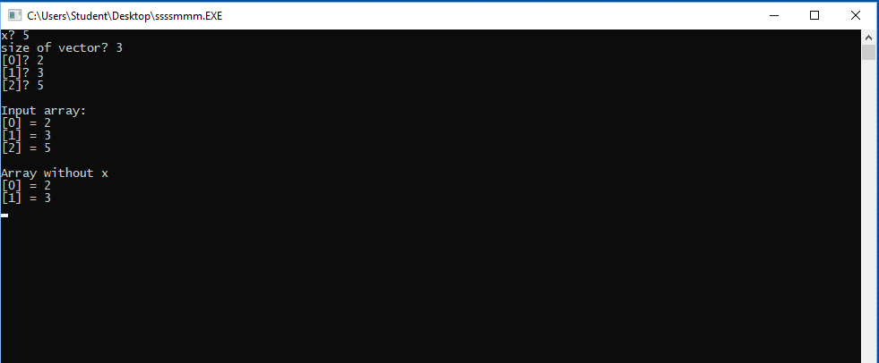
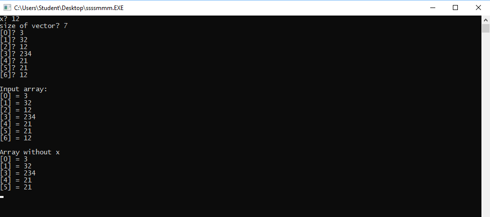
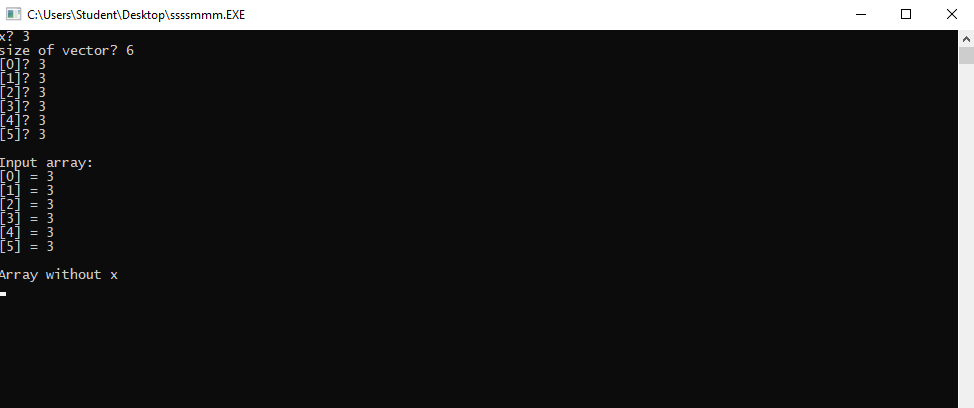
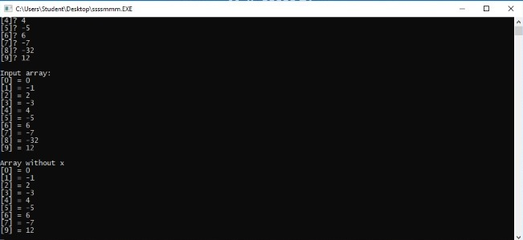

# HSE_FCS_SE-FASM2
## Бен Мустафа Анас, БПИ191
Домашняя работа №2 курса "Архитектуры вычислительных систем".
Код по каждой задаче прикреплен в соответствующей папке.

### Условие: Разработать программу, которая вводит одномерный массив A[N] и некое число Х, формирует из элементов массива A новый массив B, который состоит из элементов, не равных Х.

## Результаты работы программы
#### Тест 1.
Для начала проверим работу программы на маленьком введенном массиве. 
- **Результат работы** 
  Действительно, при введённом пользователем числе Х = 5, в выходном массиве пропадают все элементы, равные 5:
   
  
#### Тест 2.
Теперь увеличим размер массива и проверим программу.
- **Результат работы** 
  Вновь верное выполнение.
   
  
#### Тест 3.
Граничный случай. Попробуем создать массив, состоящий только из чисел X. 
- **Результат работы** 
  Действительно, 
   
  
#### Тест 4.
Рассмотрим длинный массив, содержащий также отрицательные числа.
- **Результат работы** 
  Всё работает отлично.
   
